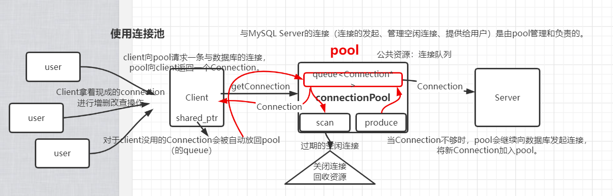

# MySQL数据库连接池

- 目的：提高对MySQL Server的访问效率

- 简易的MySQL数据库连接池，支持连接数量动态扩容和移除空闲连接。

- 类图：3种thread
  - producer thread 
  - scan thread
  - consumer thread

- 压测结果如下

| 连接量 | 无连接池       | 有连接池     |

| ------ | ------------------ | --------------- |

|     | 单线程 / 四线程   | 单线程 / 四线程 |

| 1000  | 3676ms / 3850ms   | 809ms / 410ms  |

| 5000  | 70142ms / 19898ms  | 3391ms /1478ms  |

| 10000  | 140369ms / 41888ms | 6756ms / 2716ms |

- 待改进：连接池析构时如何设计? 断开连接还是等待user使用完毕?