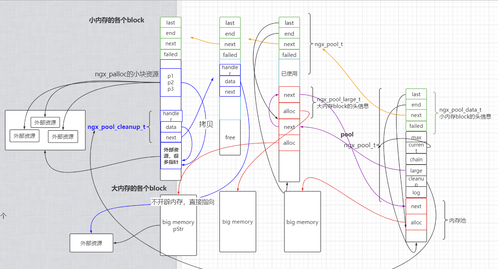
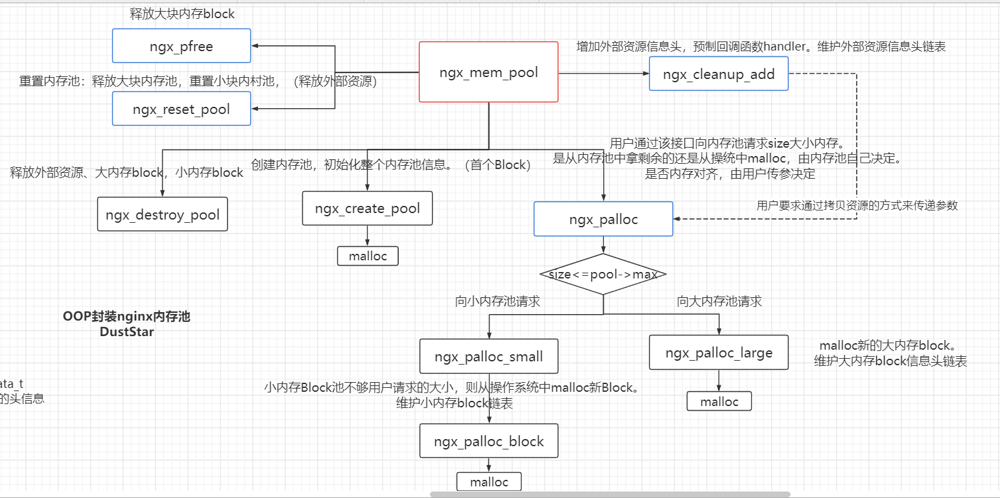

# nginx内存池源码移植

## 源码剖析

- [博客地址](https://cstardust.github.io/2022/04/22/nginx%E5%86%85%E5%AD%98%E6%B1%A0/)

## 源码导图



## class ngx_mem_pool导图



## 移植代码

- `class ngx_mem_pool`

  - 移植之后解决了ngx_reset_pool中没有释放外部资源的问题

  - 解决了reset中last指针的问题。

  - 对外接口

    ```c++
    //  构造函数，创建内存池。
    ngx_mem_pool(size_t size = NGX_DEFAULT_POOL_SIZE);
    //  析构函数，释放内存池
    ~ngx_mem_pool();
    //  考虑字节对齐，从内存池申请size大小的内存
    void* ngx_palloc(size_t size);
    //  不考虑字节对齐，从内存池申请size大小的内存
    void* ngx_pnalloc(size_t size);
    //  调用ngx_palloc，并初始化为0.
    void* ngx_pcalloc(size_t size);
    //  释放大块内存block。ngx不提供释放小块内存的接口。原因见博客
    void ngx_pfree(void* p);
    //  内存重置函数
    void ngx_reset_pool();  
    //  添加回调清理操作函数
    ngx_pool_cleanup_t* ngx_pool_cleanup_add(size_t size);
    ```

- 测试环境：ubuntu18.04 / VS Release / Debug均可。

  - ```bash
    shc@shc-virtual-machine:~/code/nginx/my_nginx$ ll
    总用量 48
    drwxrwxr-x 2 shc shc  4096 4月  30 18:49 ./
    drwxrwxr-x 4 shc shc  4096 4月  30 08:36 ../
    -rw-rw-r-- 1 shc shc     0 4月  30 18:49 data.txt
    -rwxrw-rw- 1 shc shc  6731 4月  30 08:38 ngx_mem_pool.cpp*
    -rwxrw-rw- 1 shc shc  5181 4月  30 18:44 ngx_mem_pool.h*
    -rwxrw-rw- 1 shc shc  3369 4月  30 18:49 test_mem_pool.cpp*
    -rwxrwxr-x 1 shc shc 19872 4月  30 18:49 test_mem_pool.out*
    shc@shc-virtual-machine:~/code/nginx/my_nginx$ g++ *.cpp -o test_mem_pool.out -Wall
    shc@shc-virtual-machine:~/code/nginx/my_nginx$ ./test_mem_pool.out 
    ~ngx_mem_pool
    self_handler_02
    free ptr mem!
    self_handler
    free ptr mem!
    free ptr mem!
    close file!
    ```

## Bug

- VS Debug下出现`heap corruption detected`
  - 测试代码问题：添加外部资源时的大小不对。


## nginx内存池不足（我认为）

- 链表管理
  - 链表的查找遍历时间复杂度是 O(n)。ngx_pfree 效率不高
- 小内存块链表，current 问题：
  - 当遇到密集地分配比较大的小内存场景时，导致一些小内存block分配失败，其failed 次数增加。current 指向下一个block，由于前面的结点其实可能还有足够的空闲空间分配给其它小内存的，但由于单向链表导致空闲空间利用率不高。
- ngx_reset_pool中没有释放外部资源。需要等到destroy时才可以释放。
- ngx_reset_pool中，在重置小块内村的last指针时，有一部分没有重置，造成内存碎片。

- 没有针对小块内存的释放接口。
  - 原因见博客

## 优点

- 分配小块内存十分高校：只需移动last指针
