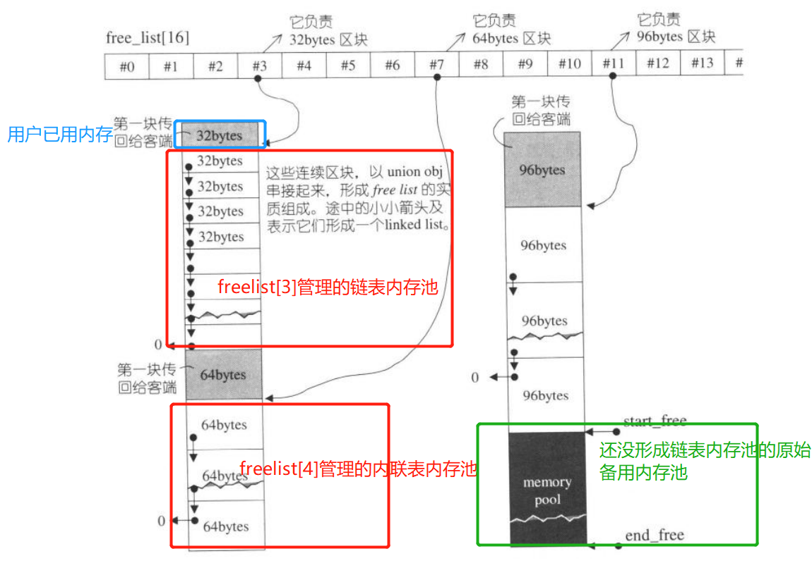
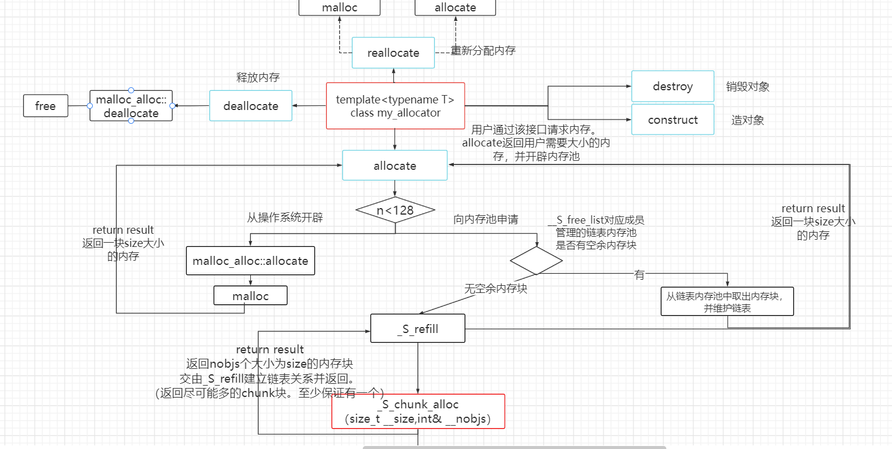
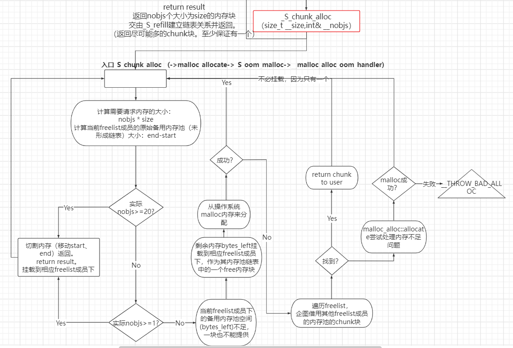

# SGI STL 二级空间配置器移植

## 二级空间配置器源码剖析 

- [sgi_stl二级空间配置器 | 不落辰 (cstardust.github.io)](https://cstardust.github.io/2022/04/16/轮子-sgi_stl二级空间配置器/)


## class \<typename T\> my_allocator

- volatile、lock_guard实现线程安全。_M_free_list_link是所有对象共有的静态成员，修改前需要加锁实现线程安全。

- my_allocator类
  - 对外接口
    - `T* allocate(size_t __n);`：用户向内存池请求内存
    - `void deallocate(void* __p, size_t __n);`：释放内存
    - `void* reallocate(void* __p, size_t __old_sz, size_t __new_sz);`：重写分配内存`
    - `template<typename Ty> void construct(T* __p, Ty&& val)`：构建对象
    - `void destory(void *p)`：销毁对象
  
- 测试环境：ubuntu18.04

  - ```bash
    shc@shc-virtual-machine:~/code/sgi_stl$ ll
    总用量 60
    drwxrwxr-x  2 shc shc  4096 4月  30 18:41 ./
    drwxr-xr-x 17 shc shc  4096 4月  30 17:19 ../
    -rwxrw-rw-  1 shc shc 13075 4月  30 18:41 myallocator.h*
    -rwxrw-rw-  1 shc shc   248 4月  30 17:20 sgi_stl_allocator.cpp*
    -rwxrwxr-x  1 shc shc 29248 4月  30 18:41 sgi_stl_allocator.out*
    shc@shc-virtual-machine:~/code/sgi_stl$ g++ sgi_stl_allocator.cpp -o sgi_stl_allocator.out -Wall
    shc@shc-virtual-machine:~/code/sgi_stl$ ./sgi_stl_allocator.out
    0
    1
    ...
    99
    ```


## my_allocator导图

- freelist结构



- 整体



- _S_chunk_alloc




## SGI STL 二级空间配置器优点

- 对于每一个字节数的chunk块分配，都是返回给用户一个使用的【1】内存块，并给freelist一个【2】内存池，【3】并留有另一部分作为原始备用内存池。这个备用可以给当前的字节数freelist成员使用，也可以给其他字节数的freelist成员使用。
- 对于备用内存池划分chunk块以后，如果还有剩余的很小的内存块，再次分配的时候，会把这些小的内存块再次分配出去，备用内存池使用的一滴不剩。
- 当指定bytes字节数内存分配失败以后，有一个异常处理的过程，当前bytes -> 128bytes所有的chunk块进行查看，如果哪个freelist成员下的内存链表池中有chunk块，借一个出去。
  - 如果操作失败，会调用`_S_start_free = (char*)malloc_alloc::allocate(__bytes_to_get)`来malloc内存；
    - `allocate`里面通过调用`oom_malloc`，来调用预先设置好的回调函数`__malloc_alloc_oom_handler`。用于处理`malloc`失败的情况。以返回用户请求的bytes大小内存


## 缺点 我认为

- STL二级空间配置器虽然解决了外部碎片与提高了效率，但它同时增加了一些缺点：
  - 因为自由链表的管理问题，它会把我们需求的内存块自动提升为8的倍数，这时若你需要1个字节，它 会给你8个字节，即浪费了7个字节，所以它又引入了内部碎片的问题，若相似情况出现很多次，就会造 成很多内部碎片；
    - 二级配置器可以很好的解决频繁调用malloc带来的时间消耗以及额外内存消耗，但是与此同时，内存池分配的小块内存都是8的倍数，也会存在一定的内部碎片，但相对于malloc而言，其性能还是好的。——侯捷

